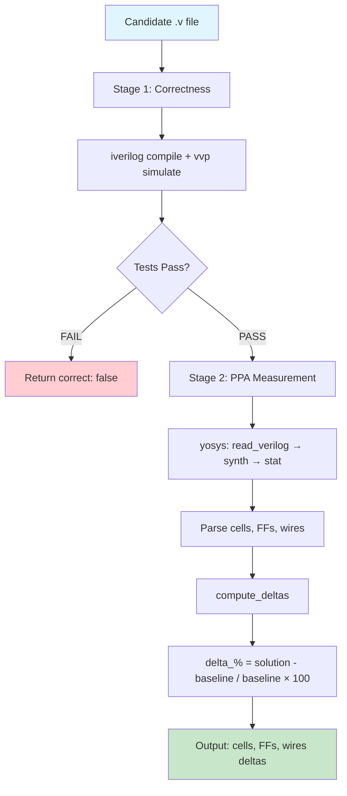

# PPAgent - Agentic RTL Optimization

A benchmarking experiment in using LLM agents to automatically optimize Verilog RTL for better PPA (Power, Performance, Area) metrics. Given a hardware module and an optimization goal, the agent reads the code, proposes a rewrite, verifies correctness with Icarus Verilog, measures improvement with Yosys, and iterates.

The example benchmark is built on real modules from the [picorv32](https://github.com/YosysHQ/picorv32) RISC-V core. Correctness is purely behavioral: the optimized module must pass the original simulation testbench. Quality is measured by how much the synthesized cell count, flip-flop count, and wire count improve versus the baseline.

---

## Project Structure

```
PPAgent/
├── benchmark/
│   ├── tasks/
│   │   ├── task_01/         # Shift-add multiplier - minimize area
│   │   ├── task_02/         # Pipelined multiplier - minimize area
│   │   ├── task_03/         # Division unit - minimize power (FF count)
│   │   ├── task_04/         # Shifter FSM - minimize timing (cycle count)
│   │   └── task_05/         # Full core feature stripping - minimize area
│   │       ├── original.v
│   │       ├── testbench.v
│   │       ├── description.md
│   │       └── baseline_metrics.json
│   ├── solutions/
│   │   ├── manual/          # Hand-optimized reference solutions
│   │   └── agent/           # Agent-generated solutions
│   └── results/
│       ├── manual_results.json     # generate with evaluate.py
│       └── agent_results.json
├── harness/
│   └── evaluate.py          # simulate(), synthesize(), compute_deltas()
├── agent/
│   ├── optimizer_agent.py   # PPAAgent + PPAModel + prompts + CLI
│   └── console.py           # Terminal output formatting
├── scripts/
│   ├── docker_run.sh        # Run any command inside the container
│   ├── eval_solution.sh     # Evaluate a single solution file
│   ├── validate_all.sh      # Batch-evaluate a solutions directory
│   └── compare_solutions.sh # Side-by-side comparison table
├── mini-swe-agent/          # foundational agent framework (git submodule)
├── picorv32/                # sample RTL source (git submodule)
├── Dockerfile
└── compose.yaml
```


## Evaluation Harness

`harness/evaluate.py` is the core of the benchmark. It provides importable functions used by both the CLI evaluation scripts and the agent itself.

### Two-Stage Pipeline




### Key Functions

```python
simulate(solution_file, testbench_file) -> {"pass": bool, "output": str, "stage": str}
synthesize(solution_file, top_module)   -> {"cells": int, "ffs": int, "wires": int}
compute_deltas(baseline, solution)      -> {"delta_cells_pct": float, ...}
load_task(task_dir)                     -> {task_id, baseline, testbench, top_module, ...}
```

These are intentionally importable. The agent calls them directly rather than shelling out to the evaluation script, so the tool results fed back to the LLM are structured Python dicts, not raw terminal output.

### Design Decisions

**Behavioral correctness oracle, not structural.** The testbench checks output equivalence, not that the RTL is identical to the original. This lets the agent restructure logic freely as long as the interface behavior is preserved.

**Pass condition is a string sentinel.** All testbenches print `ALL TESTS PASSED` on success and print specific failure messages otherwise. This avoids parsing test-framework-specific output formats and makes the pass/fail signal unambiguous.

**Yosys FF counting sums `_DFF_*` cell types.** Yosys maps flip-flops to technology-independent primitives (`$_DFF_P_`, `$_DFFE_PP_`, etc.) before any library mapping. Summing all cells whose name contains `_DFF_` gives a stable, library-independent FF count.

---

## Sample Benchmark Tasks

Five tasks drawn from picorv32, covering all three PPA dimensions and a range of difficulty.

| Task | Module | Goal | Optimization Opportunity |
|------|--------|------|--------------------------|
| task_01 | `picorv32_pcpi_mul` | area | Carry-save accumulator uses a redundant 64-FF carry register; replacing with shift-add eliminates it entirely |
| task_02 | `picorv32_pcpi_fast_mul` | area | 33-bit operands waste ~12% of the multiplier tree for unsigned instructions that only need 32 bits |
| task_03 | `picorv32_pcpi_div` | power | 63-bit `divisor` and 32-bit `quotient_msk` shift registers are counters in disguise; a 6-bit integer counter suffices |
| task_04 | `picorv32` | timing | Iterative shifter FSM processes ≤4 bits/cycle; increasing shift width reduces worst-case shift latency from 10 cycles |
| task_05 | `picorv32` | area | Optional features (`ENABLE_COUNTERS`, `CATCH_MISALIGN`, `CATCH_ILLINSN`) are on by default; hardwiring them off removes ~128 FFs and trap logic |

Each task directory contains `original.v`, `testbench.v`, `description.md`, and `baseline_metrics.json`.

---

## Optimization Agent

### Overview

The agent is built by subclassing [mini-swe-agent](https://github.com/SWE-agent/mini-swe-agent), a minimal ReAct-loop framework. Rather than building the agent plumbing from scratch (message history, cost limits, litellm API integration, retry logic, trajectory JSON export), the extension adds only RTL-domain behaviour on top of a working foundation.

The agent loop runs until the model emits a submission signal (`echo "COMPLETE_TASK_AND_SUBMIT_FINAL_OUTPUT"`) or hits the step/cost limit. Every run saves a full trajectory JSON with all messages, tool calls, and results.

### Tools

The agent has three tools:

| Tool | Provided by | What it does |
|------|-------------|--------------|
| `bash` | mini-swe-agent | Read/write files, explore workspace, run any shell command |
| `simulate` | `optimizer_agent.py` | Wraps `harness.evaluate.simulate()` — returns structured JSON pass/fail |
| `synthesize` | `optimizer_agent.py` | Wraps `harness.evaluate.synthesize()` — returns cells/FFs/wires + pre-computed deltas vs baseline |

`read_rtl`, `write_rtl`, and `get_baseline` are intentionally not implemented as separate tools — `bash` handles all file I/O, and the baseline is injected into the instance prompt. Keeping the tool count small reduces API schema overhead and gives the agent flexibility to do things not anticipated in advance (run `diff`, check syntax, inspect related modules).

### Extending mini-swe-agent

mini-swe-agent is extended at exactly two points:

#### `PPAModel(LitellmModel)`

Overrides two methods:

```python
def _query(self, messages, **kwargs):
    # Pass all three tool definitions to the API call.
    # The base class only includes BASH_TOOL.
    return litellm.completion(
        model=self.config.model_name,
        messages=messages,
        tools=ALL_TOOLS,   # [BASH_TOOL, SIMULATE_TOOL, SYNTHESIZE_TOOL]
        **(self.config.model_kwargs | kwargs),
    )

def _parse_actions(self, response):
    # Accept bash + simulate + synthesize.
    # The base class parser rejects any tool call that isn't bash.
    tool_calls = response.choices[0].message.tool_calls or []
    return parse_ppa_actions(tool_calls)
```

#### `PPAAgent(DefaultAgent)`

Overrides three methods:

```python
def run(self, task="", **kwargs):
    # Render system/instance templates, add to message history,
    # then drive the inherited step loop.

def query(self):
    # Call super().query() (LLM call + action parsing),
    # then print the assistant response and planned tool calls.

def execute_actions(self, message):
    # Route each action:
    #   action["tool"] in PPA_EXECUTORS → call Python harness function
    #   otherwise → self.env.execute(action)  (bash via LocalEnvironment)
    # Then call super's format_observation_messages to append results
    # to the message history in the correct OpenAI tool-result format.
```

Everything else — the step loop, FormatError recovery, cost accumulation, trajectory saving, litellm retry logic — is inherited from mini-swe-agent without modification.

### Typical Agent Run

```
[1] bash: cat benchmark/tasks/task_01/description.md
[2] bash: cat benchmark/tasks/task_01/original.v
[3] bash: cat > /workspace/benchmark/solutions/agent/task_01.v << 'EOF'
          ... optimized Verilog ...
          EOF
[4] simulate(solution_file, task_dir)   → {"pass": true, "output": "ALL TESTS PASSED"}
[5] synthesize(solution_file, task_dir) → {"cells": 1336, "delta_cells_pct": -11.9, ...}
[6] bash: echo "COMPLETE_TASK_AND_SUBMIT_FINAL_OUTPUT"
```

### Prompts

**System prompt** tells the model it is an RTL optimization engineer, defines the three-tool workflow, sets the simulate-before-synthesize rule, and provides goal-specific optimization strategies (minimize_area / minimize_power / minimize_timing).

**Instance template** is rendered per task with Jinja2 and injects: task directory paths, top module name, optimization goal, and the baseline PPA numbers. Providing the baseline in the prompt means the model can read synthesize results as immediate improvements without a separate tool call.

---

## Quickstart

### 1. Build the Docker environment

```bash
docker compose build
```

The image (`ppagent-env`) includes iverilog, yosys, Python 3, and all Python dependencies.

### 2. Set your OpenAI API key

Create a `.env` file in the project root:
```
OPENAI_API_KEY=sk-...
```

### 3. Run the agent on a task

```bash
# Open an interactive shell in the container
./scripts/docker_run.sh bash

# Inside the container:
OPENAI_API_KEY=$(grep OPENAI_API_KEY /workspace/.env | cut -d= -f2) \
python3 agent/optimizer_agent.py \
    --task benchmark/tasks/task_01 \
    --model openai/gpt-5-mini \
    --steps 20 \
    --output benchmark/results/run.json
```

### 4. Evaluate a solution

```bash
# Inside the container:
python3 harness/evaluate.py \
    --task benchmark/tasks/task_01 \
    --solution benchmark/solutions/agent/task_01.v \
    --verbose
```

### 5. Batch-evaluate all agent solutions

```bash
# Inside the container:
python3 harness/evaluate.py \
    --all \
    --solutions-dir benchmark/solutions/agent \
    --output benchmark/results/agent_results.json
```

---

## Tech Stack

| Component | Tool |
|-----------|------|
| RTL source | [picorv32](https://github.com/YosysHQ/picorv32) RISC-V core |
| Simulator | Icarus Verilog (`iverilog` + `vvp`) |
| Synthesizer | [Yosys](https://github.com/YosysHQ/yosys) |
| LLM | OpenAI GPT-5-mini via [litellm](https://github.com/BerriAI/litellm) |
| Agent framework | [mini-swe-agent](https://github.com/SWE-agent/mini-swe-agent) (subclassed) |
| Environment | Docker (Ubuntu 22.04) |
| Language | Python 3.10+ |
